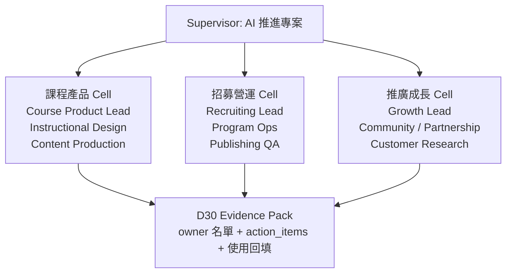
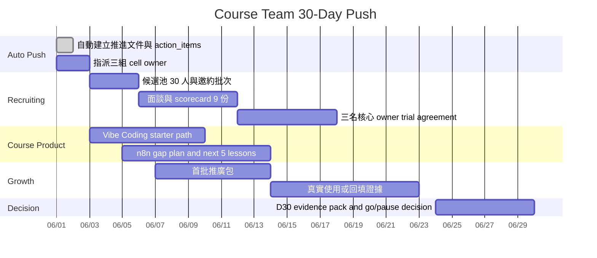

# AI 推進專案：課程團隊建置 的 30 天推進

日期：2026-06-01  
母專案：`ecd425ca-9c82-4093-b4b3-8caf1040fc8f`  
本推進專案：`f9f386e7-b8e1-49bb-acfc-c7ae4b8a6aed`  
交付型別判定：文件 / 分析 / 決策紀錄  
Supervisor：AI 推進專案：課程團隊建置 的 30 天推進

## 決策摘要

建議決策：Go。這個訊號符合「由母專案自動建立、無人工預審、AI 直接推進」條件，且目前最需要的是可被人立刻執行的組織、招募與課程產品推進文件，不是新系統。

D30 驗收日期：2026-06-30。D30 要看到 1 個可打開成果、3 個以上可追蹤 `action_items`、至少 1 次真實使用或回填證據，並做出續行 / 暫停 / 換 owner / 升級系統的明確決策。

今日可打開成果就是本文件與支撐 CSV：`docs/course-team-30-day-push.md`、`docs/course-team-action-items.csv`。決策者可以直接用本文件完成「收到母專案訊號後，啟動三組課程團隊核心招募、建立組織架構、開動首批課程產品開發與推廣」這個場景。

## 具體使用者旅程

角色：Louis / Supervisor / 課程團隊臨時負責人。

1. 2026-06-01 打開本文件，確認 AI 已從母專案訊號自動建立推進專案，狀態不再是等待人工審核。
2. 依「三組團隊組織設計」指派 3 個 cell owner：課程產品、招募營運、推廣成長。
3. 依 `docs/course-team-action-items.csv` 追蹤 D1-D30 任務，先完成 D1-D3 的 owner 指派與候選名單。
4. 用「招募 scorecard」篩選候選人，用「首批課程產品路線」啟動 Vibe Coding / n8n 課程的產品化與推廣。
5. 2026-06-30 回到本文件的 D30 驗收區，確認是否有 3 名核心 owner、至少 3 個 action items 有證據、至少 1 次真實使用或回填紀錄，再決定續行 / 暫停 / 換 owner / 升級系統。

## 問題定義

母專案「課程團隊建置」目前的卡點不是缺少單一工具，而是缺少可直接落地的三件事：

- 3 組核心團隊的 owner 與責任邊界。
- 可在 30 天內完成的招募、試作、驗收節奏。
- 課程產品開發與推廣之間的共同交付物。

如果只把訊號放進 backlog，30 天後仍可能只剩下一串待辦。這次要改成：AI 接到母專案訊號後，先產出可打開的決策與執行文件，讓人能立刻分派 owner、發出招募訊息、啟動第一批課程產品。

## 已知事實與假設

| 類型 | 內容 | 依據 |
|---|---|---|
| 已知 | 本推進專案由母專案訊號自動建立，`dispatchMode` 為 `auto_continue`，`autoDispatchable` 為 `true`。 | `context-pack.json` |
| 已知 | 開始時 supervisor 狀態為 `not_started`，job / artifact / review event 皆為 0。 | `context-pack.json` |
| 已知 | 根目錄 `courses.json` 目前列出 1 個 active 課程系列：`vibecoding`。 | `courses.json` |
| 已知 | `vibecoding/courses.json` 有 10 講，狀態皆為 open。 | `vibecoding/courses.json` |
| 已知 | `n8ncourse/courses.json` 有 3 講，狀態皆為 open；既有規格曾描述 n8n 課程為 29 講、3 講 open。 | `n8ncourse/courses.json`、`docs/spec.md` |
| 已知 | `sync_manifest.json` 顯示 Vibe Coding 第 8-10 講曾因 auto-sync 找不到 course folders 而手動同步。 | `sync_manifest.json` |
| 已知 | repo 內沒有可直接用於本次任務的招募 owner、RACI、action_items 或組織架構文件。 | `rg` 搜尋結果 |
| 假設 | 三組團隊指的是三個可獨立負責的工作 cell，不只是三個個人職稱。 | 任務描述「三組團隊核心人員招募與組織架構建置」 |
| 假設 | 「至少 1 次」依完整 context 解讀為至少 1 次真實使用 / 回填證據。 | `context-pack.json` |
| 假設 | 30 天內不宣稱完成正式長約聘僱；以核心 owner 接受任務、完成試作交付與留下證據為可驗收標準。 | 招募與合約需外部人員回覆 |

## 現況數據

| 指標 | 數值 | 解讀 |
|---|---:|---|
| 已露出的根目錄 active 課程系列 | 1 | 目前入口只看到 Vibe Coding，課程產品線對外呈現未完全一致。 |
| Vibe Coding open 講數 | 10 | 已有一條可作為首批產品化與推廣的內容線。 |
| n8n open 講數 | 3 | 有基礎，但距既有規格描述的 29 講仍有明顯內容與營運差距。 |
| Vibe Coding 資料夾大小 | 約 96 MB | 已有素材與課程頁資產，推廣素材可優先從此萃取。 |
| n8ncourse 資料夾大小 | 約 104 KB | n8n 目前更像課程骨架，需補內容生產與產品 owner。 |
| Vibe Coding 影音 / 圖片素材數 | 20 | 可支援短影音、教學截圖、社群貼文。 |
| n8ncourse 影音 / 圖片素材數 | 0 | 推廣前需補充可視化素材或改用直播 / workshop 作為第一波。 |
| 手動同步註記 | 3 | 出現在第 8-10 講，表示平台營運與發布 QA 需要 owner。 |

## 三個關鍵假說

1. 課程團隊建置的主要瓶頸不是內容靈感，而是 owner 缺口：沒有課程產品、招募營運、推廣成長三方共同節奏，內容會變成零散上架。
2. 首批成果應從既有內容資產最大的一條線開始：Vibe Coding 已有 10 講與素材，適合 D1-D14 快速做成可推廣課程產品；n8n 則適合列為第二條產品線，先補骨架與開發 owner。
3. 30 天內最合理的驗收不是「全部招滿正式團隊」，而是「三組 cell owner 到位、能交付試作、能產生至少 1 次真實使用 / 回填證據」。

## 根因分析

| 根因 | 證據 | 影響 | D30 內處理方式 |
|---|---|---|---|
| 沒有明確 owner | repo 內未找到招募 / 組織 / RACI 文件 | 卡點會留在訊號層，無法轉成交付 | D3 前指定 3 個 cell owner 與 backup |
| 課程產品線呈現不一致 | root 只列出 Vibe Coding；docs 曾描述 n8n 29 講但現況 3 講 | 決策者不易判斷優先推哪條課程 | D7 前完成首批產品路線與取捨 |
| 發布營運有手動補救 | 第 8-10 講有 manual sync 註記 | 若人員擴充後沒有發布 owner，內容量越多風險越高 | D10 前指定 QA / publishing owner 與 checklist |
| 缺少市場回填 | 目前文件未見真實使用或推廣回填 | 無法判斷招募與內容方向是否正確 | D23 前完成至少 1 次訪談、demo 或課程試聽回填 |

## 推進方式選項

| 選項 | 做法 | 成本 | 好處 | 風險 | 可逆性 |
|---|---|---:|---|---|---|
| A. 文件 / 分析先行 | 產出本決策文件、action items、招募 scorecard、D30 驗收標準 | 低 | 今天即可開跑，符合本次任務要求，不建不必要系統 | 需要人實際回覆與指派 owner | 高 |
| B. 直接建系統 | 做招募看板、任務追蹤、課程 pipeline 管理頁 | 中高 | 後續可規模化 | 目前需求仍在定義，容易建錯 | 中 |
| C. 等人工審核 | 回母專案等人確認再開始 | 低 | 降低誤判 | 與「AI 直接推進」相衝突，30 天會被壓縮 | 高 |

建議採用 A。B 的升級條件放到 D30：若 action items 超過 20 個、候選人超過 30 人、課程素材超過 3 條產品線且追蹤開始失真，再升級為系統。

## 決策紀錄

決策 ID：`DR-2026-06-01-course-team-auto-push`

決策：由母專案「課程團隊建置」的訊號自動建立 AI 推進專案，不等人工審核；本輪採文件 / 分析交付，AI 先完成可執行推進骨架。

理由：

- 任務明確要求不要一律建系統，且指定為文件 / 分析任務。
- 現況已有課程平台與內容資產，缺口在組織、招募、產品優先序與驗收節奏。
- D30 對答案需要可追蹤 action_items 與真實使用 / 回填證據；先建立文件與追蹤表比先建 UI 更快產生證據。

權限邊界：

- AI 可直接產出推進文件、action items、招募 scorecard、訪談問題、推廣草案與 D30 驗收框架。
- 任何正式錄用、薪酬、合約、公開對外承諾仍需由 Louis 或指定 owner 決策。

## 三組團隊組織設計

| Cell | D30 必須補齊的核心人員 | 責任邊界 | 首件交付物 |
|---|---|---|---|
| 課程產品 | Course Product Lead | 定義首批課程產品、課綱、學習成果、開發節奏 | Vibe Coding starter path + n8n gap plan |
| 招募營運 | Recruiting / Program Ops Lead | 候選名單、邀約、面談、試作、發布 QA owner | 30 人候選池、9 份 scorecard、3 名 cell owner 接受任務 |
| 推廣成長 | Growth Launch Lead | 受眾、定位、推廣文案、試聽 / demo、回填證據 | 首批推廣包與至少 1 次真實使用 / 回填紀錄 |

## 招募規格與 scorecard

D30 招募目標不是一次把完整部門補滿，而是讓 3 個 cell 各有 1 名可負責核心交付的 owner，且每個 owner 有可替代 backup 或合作對象。

候選池假設：

- 3 個核心 owner 名額。
- 每個名額至少 10 位候選人進池，共 30 位。
- 每個名額至少 3 位進入面談 / 試作，共 9 份 scorecard。
- 每個名額至少 1 位接受 30 天 trial owner 角色。

| 評估項 | 權重 | 通過訊號 | 淘汰訊號 |
|---|---:|---|---|
| 課程 / 內容產品判斷 | 25 | 能把課程從內容拆成學習成果、章節、交付節奏 | 只談靈感，不會收斂範圍 |
| 執行與回填紀律 | 20 | 能每天更新 action item 狀態與證據 | 任務描述模糊，無法留下驗收材料 |
| AI 工具使用能力 | 20 | 能用 AI 產出課綱、訪談題、文案、QA checklist | 把 AI 當搜尋或聊天，無交付物 |
| 推廣 / 使用者理解 | 15 | 能說清楚受眾、痛點、CTA 與回填方式 | 只做內容，不碰使用者 |
| 溝通清晰度 | 10 | 可用 5 句話說清楚進度、卡點、下一步 | 需要大量追問才知道狀態 |
| 可投入時間 | 10 | 2026-06-01 到 2026-06-30 可穩定投入 | 只能零碎協助，無 owner 能力 |

通過門檻：總分 75 以上，且「執行與回填紀律」不得低於 15 分。

面談必問題：

1. 如果你只能在 7 天內讓 Vibe Coding 變成可推廣課程產品，你會砍掉什麼、保留什麼？
2. 如果 n8n 課程目前只有 3 講但規格期待 29 講，你會怎麼排 30 天的開發節奏？
3. 你會如何讓每次課程開發都留下可驗收證據，而不是只說「有進度」？

## 首批課程產品開發與推廣

| 產品線 | 現況 | D30 目標 | 取捨 |
|---|---|---|---|
| Vibe Coding / AI Coding | 10 講 open，20 個影音 / 圖片素材，近期仍有新增 commit | 做成首批可推廣 starter path，產出課程賣點、學習成果、試聽或 demo 回填 | 優先推廣；不等全新內容 |
| n8n AI 自動化 | 3 講 open，既有規格提到 29 講 | 補成產品開發 plan，確認下一批 5 講主題、素材缺口、發布 owner | 先定義產品路線，不承諾 30 天補完 29 講 |
| 課程團隊工作流 | 目前無專屬組織文件 | 形成 3 cell owner 運作方式與 evidence pack | 不建系統；用文件與 CSV 先跑一次 |

首批推廣包應包含：

- 1 個主張：用 AI 工具加速開發，打造真實可用的產品。
- 1 個受眾：想把 AI 從聊天工具變成工作流 / 產品輸出的學員或企業團隊。
- 1 個 CTA：預約試聽 / demo / 內部導入諮詢。
- 3 則內容：課程成果截圖、學員可完成的任務、課程前後能力差異。
- 1 個回填表：來源、日期、對象、痛點、反應、下一步。

## 30 天節奏圖

## 可追蹤 action_items

完整支撐表：`docs/course-team-action-items.csv`。

| ID | Due | Owner | 任務 | 驗收訊號 |
|---|---|---|---|---|
| AICT-001 | 2026-06-01 | AI Supervisor | 建立本推進文件與 action_items | 文件與 CSV 可打開 |
| AICT-002 | 2026-06-03 | Louis / Supervisor | 指定三組 cell owner 與 backup | 3 個 owner 名字、聯絡方式、投入時段 |
| AICT-003 | 2026-06-05 | Recruiting Lead | 建立 30 人候選池 | 候選表含來源、角色、優先級 |
| AICT-004 | 2026-06-06 | Recruiting Lead | 發出第一批 15 封邀約 | 訊息紀錄與回覆狀態 |
| AICT-005 | 2026-06-12 | Recruiting Lead + Cell Leads | 完成 9 份面談 scorecard | 每份有分數、風險、建議 |
| AICT-006 | 2026-06-18 | Louis / Recruiting Lead | 取得 3 名核心 owner trial agreement | 文字確認與 D30 交付承諾 |
| AICT-007 | 2026-06-07 | Course Product Lead | 完成 Vibe Coding starter path | 學習成果、章節、推廣賣點 |
| AICT-008 | 2026-06-14 | Course Product Lead | 完成 n8n gap plan 與下一批 5 講 | 每講主題、素材缺口、owner |
| AICT-009 | 2026-06-14 | Growth Lead | 完成首批推廣包 | 3 則內容、1 個 CTA、1 個回填表 |
| AICT-010 | 2026-06-23 | Growth + Product | 完成至少 1 次真實使用 / 回填 | 試聽、demo、訪談或內部導入紀錄 |
| AICT-011 | 2026-06-30 | Supervisor | D30 決策 | 續行 / 暫停 / 換 owner / 升級系統 |

## 風險與對策

| 風險 | 觸發訊號 | 對策 |
|---|---|---|
| 找不到 3 名 owner | 2026-06-12 前少於 6 位合格面談者 | 降低範圍：先鎖 1 名總 owner + 2 名 fractional owner |
| 內容開發被 n8n 29 講拖住 | 2026-06-07 前仍要求一次規劃全部 29 講 | 改成下一批 5 講，D30 只驗收 gap plan 與 owner |
| 推廣沒有回填 | 2026-06-14 前沒有 CTA 或試聽對象 | 由 Growth Lead 直接發 10 位 warm audience 訊息 |
| 發布 QA 被手動流程卡住 | 新內容上架再次出現 manual sync | Publishing QA owner 建立上架 checklist，D30 再判斷是否升級系統 |
| 文件變成靜態報告 | action_items 7 天未更新 | D7 直接換 owner 或縮小交付範圍 |

## D30 驗收標準

最低通過：

- 1 個可打開成果：本文件或更新後的 D30 evidence pack 可被決策者打開。
- 3 個以上 action_items 有 owner、due date、狀態、證據連結或文字紀錄。
- 至少 1 次真實使用 / 回填證據：試聽、demo、訪談、內部導入或候選 owner 試作皆可，但必須有日期、對象、觀察與下一步。
- 三組團隊核心架構可見：課程產品、招募營運、推廣成長各有 owner 或替代 owner。
- 首批課程產品開發與推廣已啟動：Vibe Coding starter path 與 n8n gap plan 至少一項有可驗收交付。

升級系統條件：

- 候選人超過 30 人且 CSV 追蹤開始失真。
- action_items 超過 20 個且跨 3 個以上 owner。
- 課程產品線超過 3 條，且需要狀態、素材、發布、推廣回填的統一看板。
- D30 evidence pack 顯示人工作業重複且有穩定欄位，才進入系統化。

## 下一步

第一步：2026-06-03 前，由 Louis / Supervisor 指定三組 cell owner。若尚未有人選，先指定臨時 owner，讓招募與課程產品兩條線同時開跑。

第一個可驗收動作：把 `docs/course-team-action-items.csv` 的 `owner` 欄從角色改成真實人名，並在 `evidence` 欄留下第一筆指派紀錄。
